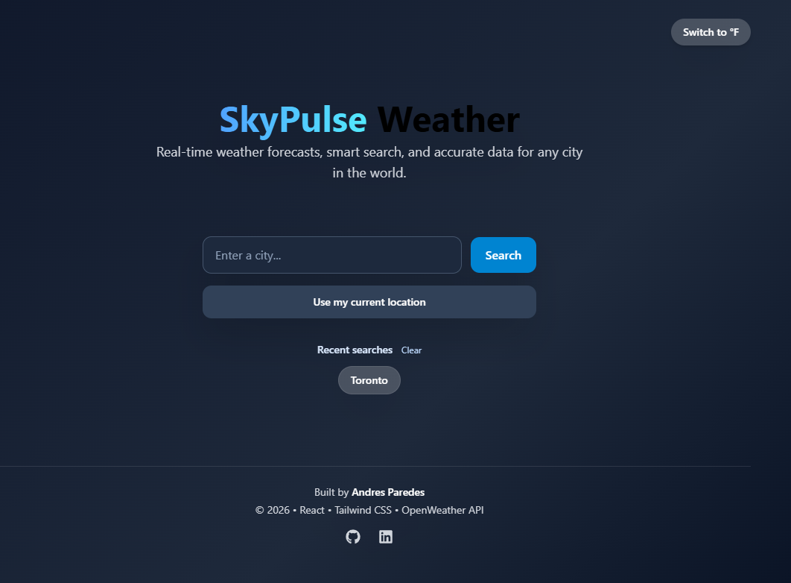
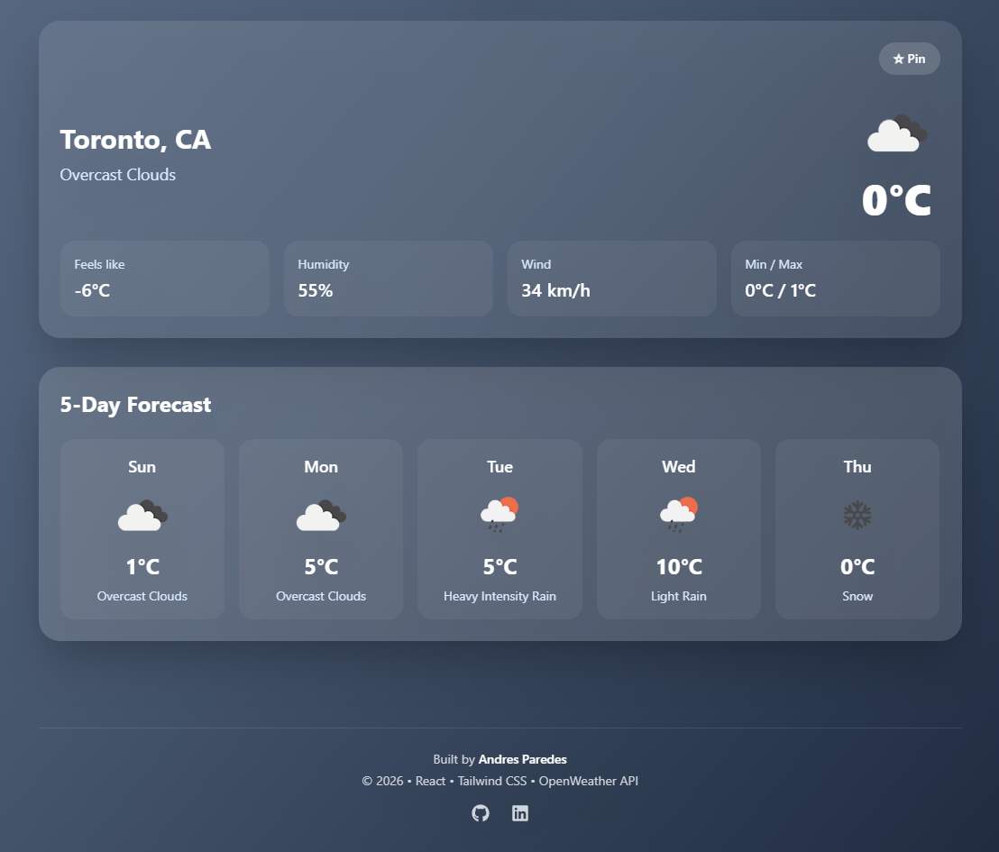
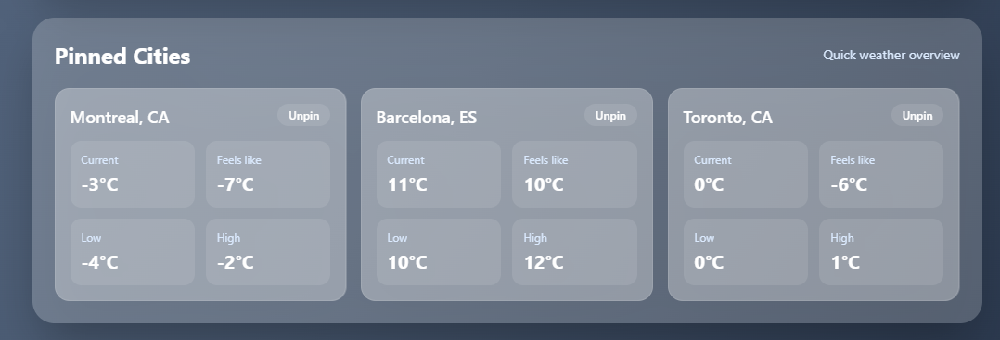
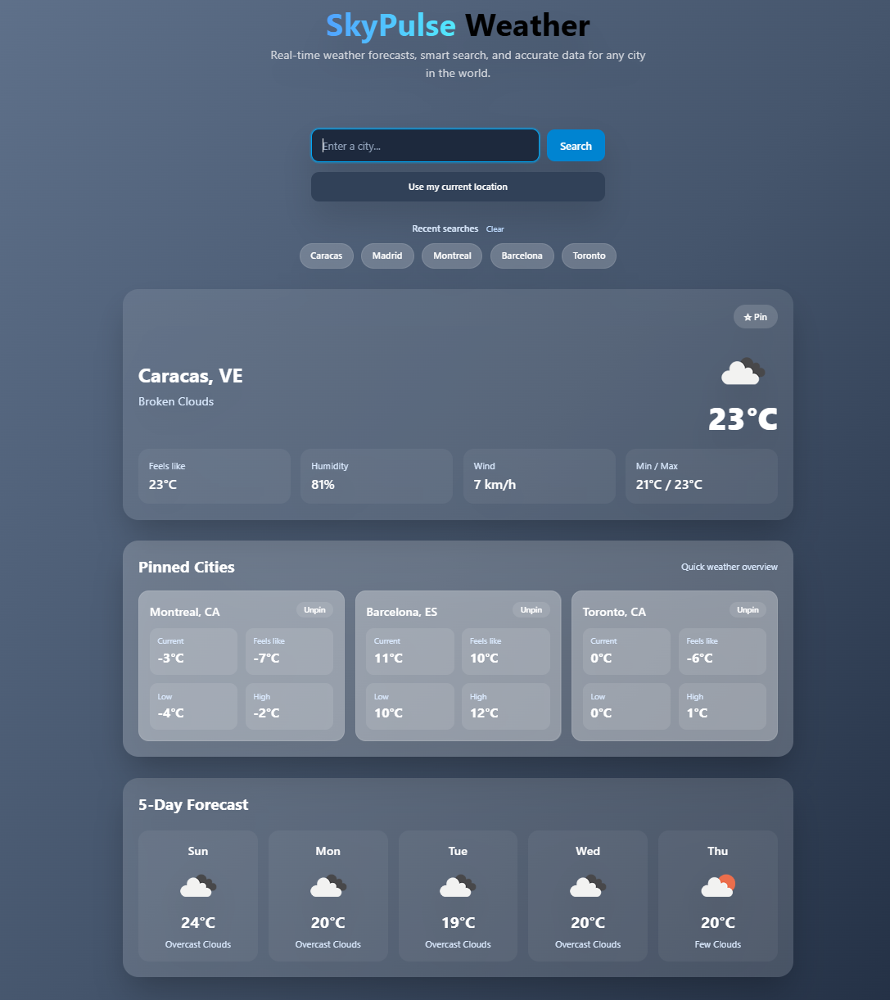

<<<<<<< HEAD
<<<<<<< HEAD
# Weather-Website_Project
=======
# React + Vite

This template provides a minimal setup to get React working in Vite with HMR and some ESLint rules.

Currently, two official plugins are available:

- [@vitejs/plugin-react](https://github.com/vitejs/vite-plugin-react/blob/main/packages/plugin-react) uses [Babel](https://babeljs.io/) (or [oxc](https://oxc.rs) when used in [rolldown-vite](https://vite.dev/guide/rolldown)) for Fast Refresh
- [@vitejs/plugin-react-swc](https://github.com/vitejs/vite-plugin-react/blob/main/packages/plugin-react-swc) uses [SWC](https://swc.rs/) for Fast Refresh

## React Compiler

The React Compiler is not enabled on this template because of its impact on dev & build performances. To add it, see [this documentation](https://react.dev/learn/react-compiler/installation).

## Expanding the ESLint configuration

If you are developing a production application, we recommend using TypeScript with type-aware lint rules enabled. Check out the [TS template](https://github.com/vitejs/vite/tree/main/packages/create-vite/template-react-ts) for information on how to integrate TypeScript and [`typescript-eslint`](https://typescript-eslint.io) in your project.
>>>>>>> c9f62c7 (Initial commit)
=======
# Weather-Website-Project
# SkyPulse Weather App

SkyPulse is a modern weather application that allows users to search for any city in the world and view real-time weather conditions, a 5-day forecast, and detailed weather information. The application also supports geolocation, pinned cities, recent searches, and dynamic backgrounds based on weather conditions.

## Live Demo

(https://weather-website-project-4hcx.vercel.app/)

## Features

* Search weather by city name
* Use current location (Geolocation)
* 5-day weather forecast
* Switch between Celsius and Fahrenheit
* Recent searches (saved in LocalStorage)
* Pin favorite cities
* Dynamic backgrounds based on weather conditions
* Animated weather effects (rain, snow, thunder, clear)
* Responsive design for mobile and desktop

## Technologies Used

* React
* Tailwind CSS
* OpenWeather API
* LocalStorage
* Geolocation API
* Vercel (Deployment)

## Project Structure

src/
components/
HeroSection.jsx
SearchBar.jsx
WeatherCard.jsx
ForecastSection.jsx
PinnedCitiesPanel.jsx
Loader.jsx
ErrorMessage.jsx
Footer.jsx

pages/
Home.jsx

services/
weatherApi.js

## What I Learned

While building this project, I improved my skills in:

* Working with APIs and asynchronous JavaScript
* Managing state in React
* Component-based architecture
* Responsive UI design with Tailwind CSS
* Using LocalStorage to persist user data
* Deploying applications using Vercel

## Future Improvements

* Hourly forecast
* Dark/Light mode toggle
* Weather map integration
* Multi-language support

## Screenshots

## Author

Andres Paredes
GitHub: https://github.com/aparedesp2003
LinkedIn: https://www.linkedin.com/in/andresparedesp/
